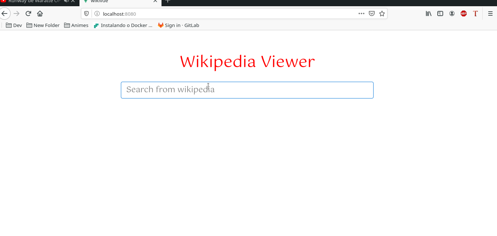

# wikivue
<p>

**simple project using wikipedia's public api to list articles with real-time searches in a SPA.**

</p>
<p align="center">

  <a href="https://github.com/brunogeek9" target="_blank">
    
  </a>
  <a href="https://github.com/brunogeek9" target="_blank" >
    
  </a>
  <a href="https://www.linkedin.com/in/brunojamelli/" target="_blank" >
    
  </a>
  <a href="mailto:brunogeek9@gmail.com" target="_blank" >
    
  </a>
  <a href="https://api.whatsapp.com/send?phone=558481069624"
        target="_blank" >
    
  </a>

</p>

## Project setup
```
npm install
```

### Compiles and hot-reloads for development
```
npm run serve
```

### Compiles and minifies for production
```
npm run build
```

### Lints and fixes files
```
npm run lint
```

### Demonstration


---

## :memo: License

This project was done under the MIT license. See more here [LICENSE](/LICENSE) for more information.
Made by [Bruno Jamelli](https://github.com/brunogeek9)